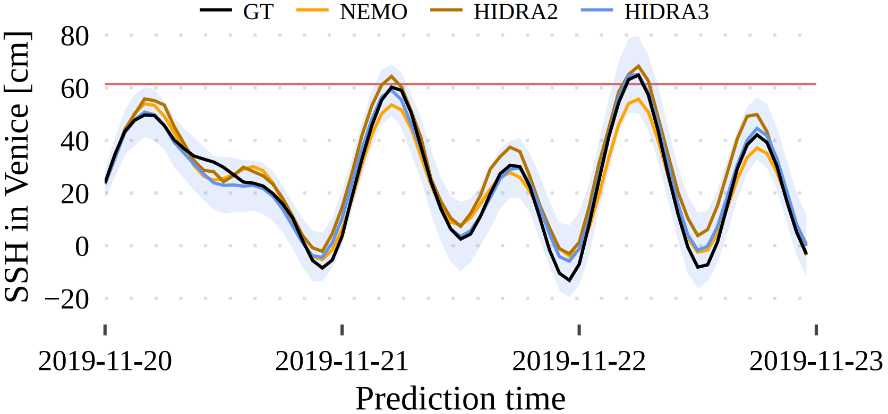

## HIDRA3: A Robust Deep-Learning Model for Multi-Point Sea-Surface Height Forecasting

<p align="center">
    
</p>

HIDRA3 is a state-of-the-art deep neural model for multi-point sea-level prediction based on past
sea level observations and future tidal and geophysical forecasts.
This repository contains the implementation of HIDRA3 and code to
train and evaluate the model. We publish HIDRA3 weights pretrained on 11 locations from 2000 to 2023 without the period from June 1, 2019, to December 31, 2020, which
was used for the evaluation. We provide the predictions for the test period for all 11 locations for 50 atmospheric ensembles. 
Geophysical training and test datasets are published at destinations listed below, we also publish SSH measurements from Koper.

<p align="center">
    
</p>

### Setup

To install the required packages, run

```
pip3 install -r requirements.txt
```

### Evaluation

To evaluate the predictions of HIDRA3 from Jun 2019 – Dec 2020, download the predictions and tide gauges data from [this link](),
store them in the `data` folder and run

```
cd src
python3 eval.py
```

To recalculate the predictions, download the test data and pretrained HIDRA3 parameters from [this link](), store them in the `data` folder
and run

```
cd src
python3 test.py
```

### Training

Pretrained weights are available at [this link](). To retrain the model, download
the training data from [this link]() and run

```
cd src
python3 train.py
```

### Structure of the Inputs

Inputs to the HIDRA3 model are geophysical, SSH and tidal data, each structured as follows:

| Name     | Shape            | Description                                                                                                                                                                                                                                                                                                                            |
|----------|------------------|----------------------------------------------------------------------------------------------------------------------------------------------------------------------------------------------------------------------------------------------------------------------------------------------------------------------------------------|
| `geophy` | 144 × 8 × 9 × 12 | Hourly geophysical forecasts from 72 h prior the prediction point to 72 h into the future. Second dimension contains mean sea-level air pressure, u10 and v10, SST, mean wave period, significant height of combined wind waves and swell, and sine and cosine of mean wave direction. Last two dimensions are latitude and longitude. |
| `ssh`    | N × 72           | Past SSH for N locations.                                                                                                                                                                                                                                                                                                              |
| `tide`   | N × 144          | Past and future tide for N locations.                                                                                                                                                                                                                                                                                                  |

Mask is denoted with `NAN` values in the ocean variables. Unknown values in tide and SSH are also denoted with `NAN` values.

The model outputs 72 points for each location representing hourly sea level forecast, and for each prediction, also the estimated standard deviation. 
All inputs and outputs of HIDRA3 are standardized, the statistics are stored in `data/normalization_parameters.yaml`.

### Structure of the Data

In [README.md](data%2FREADME.md), we describe the structure of the data files used in this repository. There you can 
also find the description of how to add new locations to the dataset.

